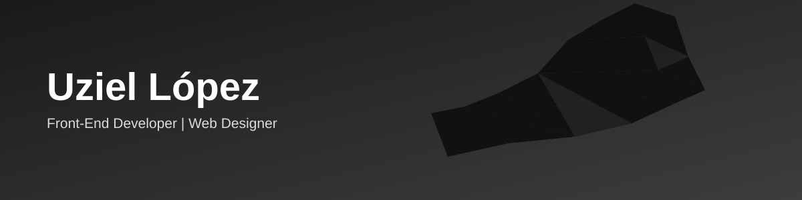

 

  

&#8287;&#8287;&#8287;

&#8287;&#8287;&#8287;

<h3 align="center">
&nbsp; Sobre mí
</h3>

<table align="center" width="90%">
<tr><td>
&nbsp; Desarrollador front-end enfocado en <b>web design</b> y experiencias digitales pulidas
</td></tr>
<tr><td>
&nbsp; Servicio social en la <b>Facultad de Informática Culiacán (FIC)</b>
</td></tr>
<tr><td>
&nbsp; Desarrollador principal del sitio web de <b>Iglesia Nueva Vida</b>
</td></tr>
<tr><td>
&nbsp; Explorando Android (WebView híbrido) y automatización con Python
</td></tr>
</table>

<h2>&nbsp; Proyectos destacados</h2>

<table align="center">
<tr>
<td width="50%" valign="top">
<b>Restaurante Panamá</b> 
Sistema de reservaciones de lujo — Auth (email/Google/SMS), plano interactivo, calendario, PWA y app híbrida en Android.
</td>
<td width="50%" valign="top">
<b>Iglesia Nueva Vida</b> 
SPA en JS vanilla + Firebase/Firestore, CMS con rich-text editors, sistema de WhatsApp/QR, streaming EN VIVO.
</td>
</tr>
</table>

<h2>&nbsp; Stack</h2>

<h3 align="center">Lenguajes</h3>

<h3 align="center">Frameworks y librerías</h3>

<h3 align="center">Backend, hosting y bases de datos</h3>

<h3 align="center">Herramientas</h3>

